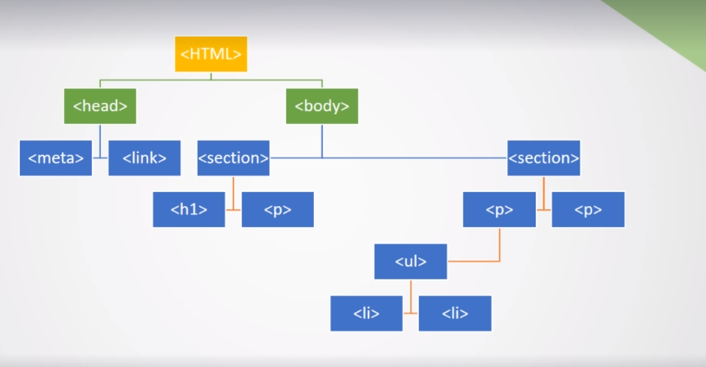

# DOM
Document
Object
Model

Modelo de objetos del documento(como un arbol genealógico), donde cada etiqueta tiene sus respectivas etiquetas Padres e Hijos, creando una estructura lógica para el documento.

***
# DOCTYPE
Es una directiva que le indica al navegador (motor de render) la versión de Html que estamos escribiendo. De este modo el motor sabe como interpretar y mostrar los elementos del documento.

Ejemplo:

[https://julianortiz6605.github.io/-1.2-Renderizado-Html/]
